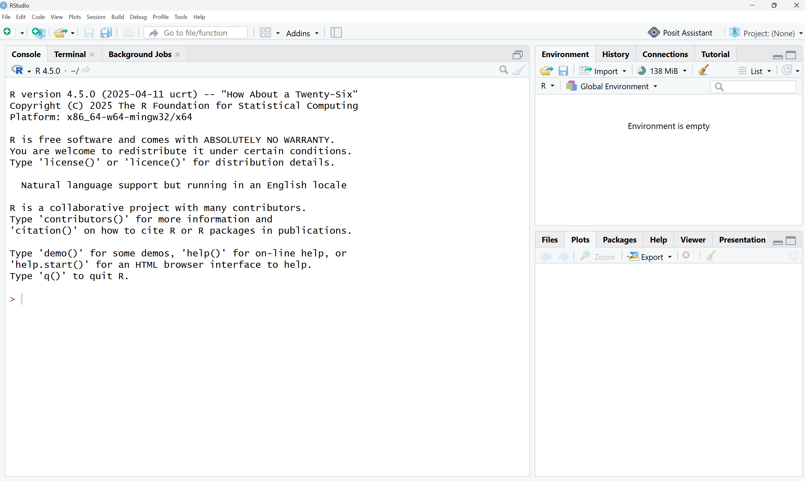

# Análisis socioespacial con R

Este repositorio contiene los materiales del curso **Análisis socioespacial con R** de [LabUrba](https://www.laburba.cl/).

El curso está orientado a introducir el uso de R para el análisis de datos, con especial énfasis en aplicaciones geográficas y socioespaciales.

##Instalación de R y RStudio

En este curso utilizaremos R a través del IDE RStudio. ¿Qué es un IDE? IDE es el acrónimo de Integrated Development Environment (Entorno de Desarrollo Integrado). Esto quiere decir que RStudio es una aplicación que nos entrega herramientas para hacer más fácil el desarrollo de proyectos usando R.

Para poder instalar R y RStudio, sigue los siguientes pasos:

 Para poder instalar R y RStudio, sigue los siguientes pasos:

- Descarga R desde [https://cran.r-project.org/](https://cran.r-project.org/). Debes elegir la opción que corresponda según tu sistema operativo.

- Instala R en tu computador, tal como lo haces con cualquier programa.

- Una vez que R ha quedado correctamente instalado, descarga RStudio desde [https://posit.co/download/rstudio-desktop/](https://posit.co/download/rstudio-desktop/).

- Instala RStudio en tu computador, tal como lo haces con cualquier programa.

Si quedó todo bien instalado, cuando abras RStudio deberías ver algo así:

Para el desarrollo del curso utilizaremos la versión de R 4.6.1

## Descarga tus primeros paquetes

Durante el curso utilizaremos distintos paquetes de R. Para comenzar, instalaremos **tidyverse**, una colección de paquetes diseñados para importar, transformar, analizar y visualizar datos.

Para instalar `tidyverse`, copia y ejecuta el siguiente código en la **Consola de RStudio**:

   - install.packages("tidyverse")

## Contenidos

Los materiales del curso se encuentran organizados en cuatro módulos. Los materiales de cada modulo quedarán despues de cada clase disponibles en Teams y en este perfil de github después de cada clase. 

### Módulo 1
Introducción a R y primeros pasos.

### Módulo 2
Manipulación y análisis de datos.

### Módulo 3
Análisis y visualización de datos espaciales.

### Módulo 4 
Producción de un dashboard con Ia generativa. 